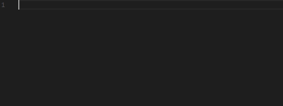
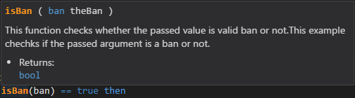
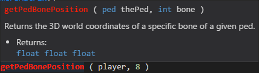
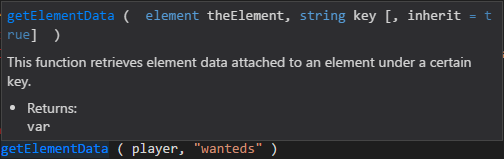
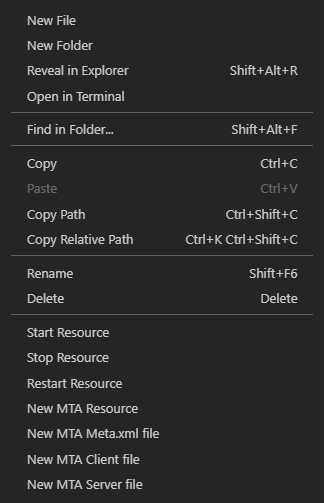
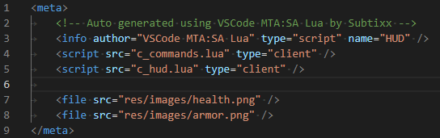
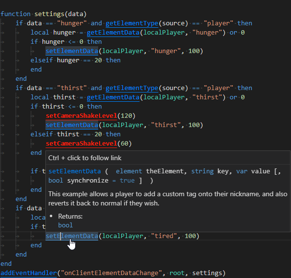
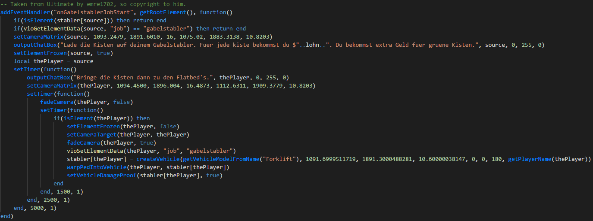
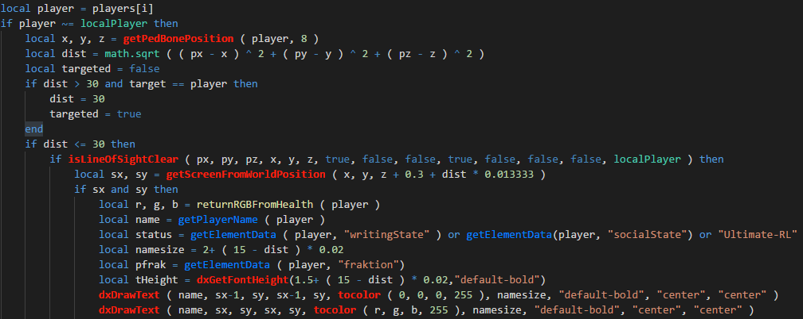
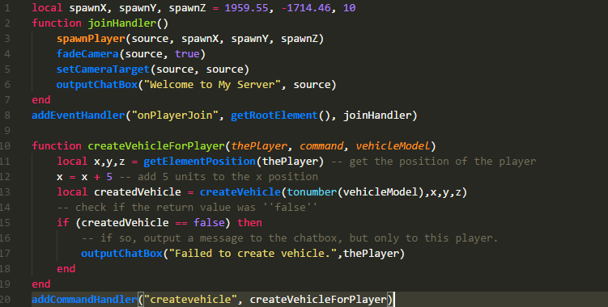

    

    

<h3 align="center">
  MTA:SA Lua
</h3>

    MTA:SA Lua is a VS Code extension to add syntax highlighting, code completion and other useful functions for MTA San Andreas LUA to VS Code.

    
    

# Table of contents

- [Table of contents](#table-of-contents)
- [Preview Images](#preview-images)
    - [Code Completion](#code-completion)
    - [Syntax Highlighting](#syntax-highlighting)
        - [Server only Function](#server-only-function)
        - [Client only Function](#client-only-function)
        - [Shared Function](#shared-function)
    - [Generate Files and Manage resources](#generate-files-manage-resources)
    - [Reference Link Provider](#reference-link-provider)
    - [VSDark](#vsdark)
        - [Server](#server)
        - [Client](#client)
    - [Monokai (Unsupported)](#monokai-unsupported)
- [Configuration Options](#configuration-options)
- [Changelog](#changelog)
- [References](#references)

# Preview Images

## Code Completion

Code Completion shows what functions are available

## Syntax Highlighting

### Server only Function

Server only functions will be highlighted in orange

### Client only Function

Client only functions will be highlighted in red

### Shared Function

Shared functions will be highlighted in blue

## Generate files Manage resources

Easy way to generate meta.xml and script files

## Reference Link Provider

Easy way to access documentation on the MTA Wiki

## VSDark

### Server

### Client

## Monokai (Unsupported)

# Configuration Options

## mtalua-http.enabled

Enable the WebAdmin Http Functionality for restarting/starting/stopping resources

## mtalua-http.enable_restart_on_save

Enable automagically restarting resources when saving

## mtalua-http.enable_search_hinting

Enable search hinting when restarting resources (Requires http whitelisting this ip)

## mtalua-http.uri

URL to the MTA Http Server

## mtalua-http.username

Authentication username for the MTA Http Server required for restarting/starting/stopping resources

## mtalua-http.password

Authentication password for the MTA Http Server restarting/starting/stopping resources

## mtalua-generate.author

Allows you to set a custom author when generating new resources (meta.xml -> info -> author)

## mtalua-generate.watermarking

Enable or disable watermarking of meta files (will place a comment with a notice that the meta was generated by this extension)

## mtalua-generate.meta_default_version

Default version when generating new resources (meta.xml -> info -> version)

## mtalua-generate.meta_default_type

Default type of new resources (script, gamemode, map, misc)

## mtalua-generate.shared_prefix

Custom suffix/prefix for shared files (Default is g_ prefix)
This will treat files named g_test or test_g as shared files

## mtalua-generate.shared_extension

Custom extension for shared files (Default is lua)
This will treat files named test.glua as shared files

## mtalua-generate.shared_prefix_type

If the shared is a prefix (true) or a suffix (false) (Prefix g_test Suffix test_g)

## mtalua-generate.client_prefix

Custom suffix/prefix for client files (Default is c_ prefix)
This will treat files named c_test or test_c as client files

## mtalua-generate.client_extension

Custom extension for client files (Default is lua)
This will treat files named test.clua as client files

## mtalua-generate.client_prefix_type

If the client is a prefix (true) or a suffix (false) (Prefix c_test Suffix test_c)

## mtalua-generate.server_prefix

Custom suffix/prefix for server files (Default is s_ prefix)
This will treat files named s_test or test_s as server files

## mtalua-generate.server_extension
Custom extension for server files (Default is lua)
This will treat files named test.slua as server files

## mtalua-generate.server_prefix_type
If the server is a prefix (true) or a suffix (false) (Prefix s_test Suffix test_s)

## mtalua-generate.activate_client_file_generation

When activated generates a client file when using generate new resource

## mtalua-generate.default_client_content

Allows you to set custom content that should be placed in the newly generated client file

## mtalua-generate.activate_server_file_generation

When activated generates a server file when using generate new resource

## mtalua-generate.default_server_content

Allows you to set custom content that should be placed in the newly generated server file

## mtalua-generate.activate_shared_file_generation

When activated generates a shared file when using generate new resource

## mtalua-generate.default_shared_content

Allows you to set custom content that should be placed in the newly generated shared file

## mtalua-generate.modify_meta

When adding new client/server-side files should the meta.xml automagically be modified?

## mtalua-generate.filesrc_extensions

Extensions which are declated as file

## mtalua-sense.activate_signature_help_parentheses

Allows you to disable the signature help when using (

## mtalua-sense.activate_signature_help

Allows you to disable the signature help completely

## mtalua-sense.show_relevant_only

Only show relevant functions (A serverside script is open, only serverside & shared functions will show)

## mtalua-sense.show_reference_links (v2.3.5 and up)

Make functions clickable which redirect directly to the MTA Wiki

# Changelog

## v2.3.6 (19. Jan 2019)

- Bugfix for dependency 'request'

## v2.3.5 (13. Jan 2019)

- Added ability to make document full of links to the MTA Wiki
- More internal seperation of different types of functions (peds, vehicles, engine)
- Bugfixes for functions

## v2.3.2 (13. Jan 2019)

- Added ability to only show relevant functions (Serverside only functions will only display in server lua files)
- Removed duplicated functions
- Scriptside will now show in completion items

## v2.3.1 (11. Jan 2019)

- Added 1.5.6 functions and deprecations
- Search hinting for new resource manager
- Added verification if resource exists

## v2.3.0 (9. Jan 2019)

- Added resource manager to start/stop/restart resources
- Fixed existing files in generate classes will break extension
- Fixed some missing information in some functions

## v2.2.5 (8. Jan 2019)

- Added more settings
- Added the ability to modify existing meta files
- Added the ability to customize file extensions, file prefix/suffixes
- Added the ability to turn off watermarking
- Fixed generating client files
- Fixed extension upload

## v2.2.0 (7. Jan 2019)

- Added the ability to create meta/client/server files on the fly

# References
- Thanks to 50p for the sublime text syntax highlighter. Which inspired me to create the VSCode extension.