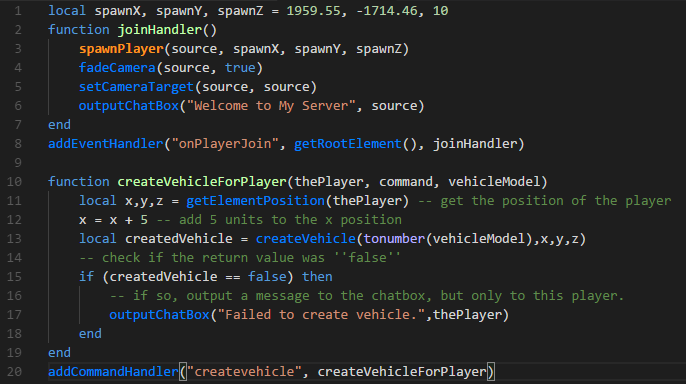

    

    

<h3 align="center">
  MTA:SA Lua
</h3>

MTA:SA Lua is a VS Code extension to add syntax highlighting and code completion for MTA San Andreas LUA to VS Code.

    
    

# Table of contents

- [Table of contents](#table-of-contents)
- [Examples](#examples)
    - [Code Completion](#code-completion)
    - [VSDark](#vsdark)
    - [Monokai](#monokai)
- [References](#references)

# Examples

## Code Completion

## VSDark

## Monokai

# References
- Thanks to 50p for the sublime text syntax highlighter. Which inspired me to create the VSCode extension.